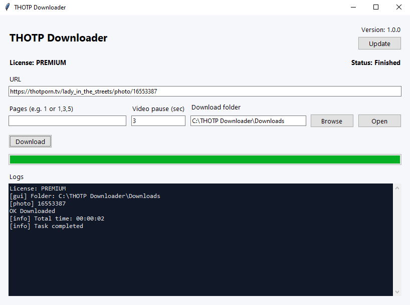

# THOTP Downloader

Windows application for downloading photos and videos from THOTP using a simple and easy-to-use graphical interface.

## Features

### Photos

Download:

- Individual photos
- All photos from a page
- Multiple selected pages
- Complete profiles

### Videos

Download:

- Individual videos
- Videos from pages
- Available content according to your license plan

### Application Features

- Simple Windows GUI
- Download progress tracking
- Pause and resume downloads
- Cancel active tasks
- Choose custom download folder
- Open download folder directly from the application
- Automatic updates

---

# Download

Download the latest version from GitHub Releases:

[Releases](../../releases)

Download the latest `.exe` file and run the application.

No Python installation is required.

---

# Requirements

## Operating System

- Windows 10
- Windows 11

## Additional Software

Video downloads require:

- N_m3u8DL-RE

Some video processing features may require:

- FFmpeg

Required components are included or provided depending on the distributed version.

---

# Getting Started

1. Download the latest release.
2. Extract the files.
3. Open the application.
4. Enter the THOTP URL.
5. Select your download folder.
6. Start downloading.

---

# Supported Downloads

Individual Photo

Example:

https://thotporn.tv/.../photo/ID

Individual Video

Example:

https://thotporn.tv/.../video/ID

Pages

Download all available photos or videos from a selected page.

Profiles

Process all available content from a profile.

# Licensing

THOTP Downloader includes FREE and PREMIUM features.

Some functionality requires a valid PREMIUM license.

License information and account management are handled separately from this repository.

# Screenshots

# Support

If you encounter a problem or have a question:

Open a GitHub Issue
Provide details about the problem
Include relevant logs or screenshots when possible
Third-Party Software

This application uses open-source software and external tools:

Python
Tkinter
PyInstaller
N_m3u8DL-RE
FFmpeg

Please refer to their respective licenses.

# License

See the LICENSE file for usage and distribution terms.
